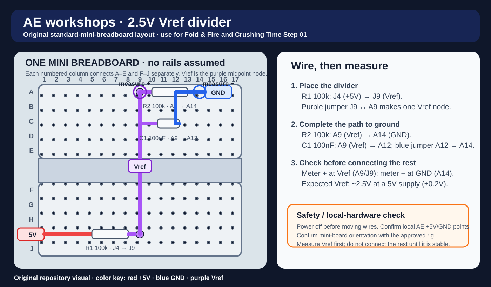

# Build Step 01 — Power + Vref (Black board)

## Goal
Create a stable 2.5V reference (Vref) and prove your rails are correct.

## Breadboard placement map

This original map covers the Vref divider only. The instructor-approved AE BRAEDBOARD power points, board orientation, and measurements override the map.

## Place
- Choose a convenient row on the black board as **Vref**.

## Wire
1. 100k: +5V → Vref
2. 100k: Vref → GND
3. 100nF: Vref → GND (close)

## Measure
- Vref should read ~2.5V (±0.2V)

## Common failures
- Rail breaks (breadboards often split rails)
- Resistor in wrong row
- Cap not actually to ground
