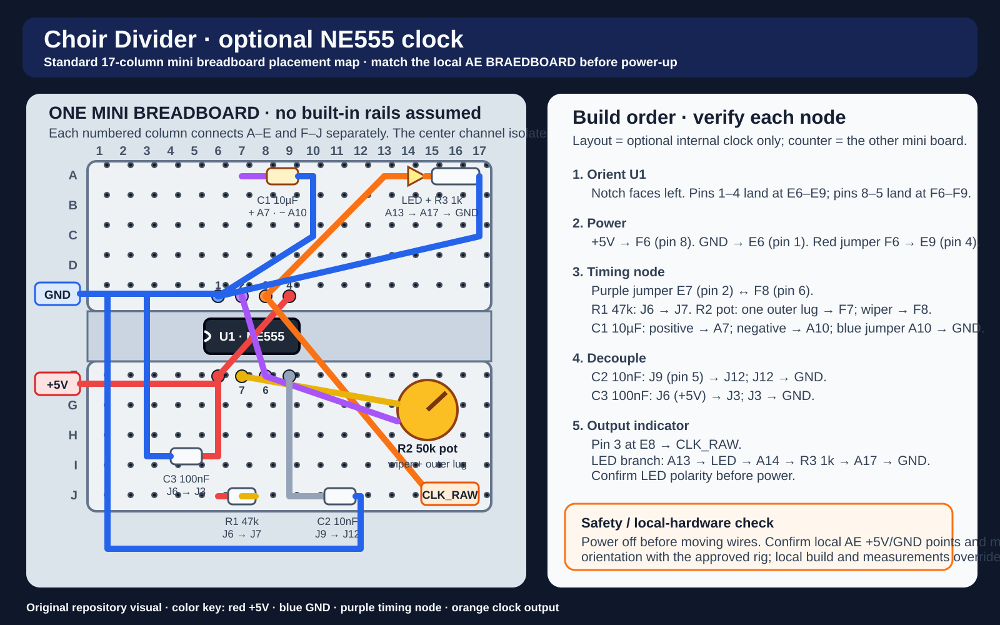

# Build Step 03 — Clock (NE555) + indicator

## Goal
Make a controllable clock from very slow to very fast.

## Breadboard placement map

The optional internal 555 clock uses the same core net as Choir Divider. Confirm the local AE BRAEDBOARD power points, board orientation, and measurements before adding the later CV-conditioning stage.

## Wire (NE555 astable)
- RESET to +5V
- Tie TRIG to THR
- 47k from +5V to DISCH
- 50k pot between DISCH and THR/TRIG node
- 10uF from THR/TRIG node to GND
- OUT is CLK_RAW
- 10nF from CTRL to GND (and 100nF from VCC to GND close)

## LED indicator (optional but recommended)
- CLK_RAW → 1k → LED → GND
(If too dim at high frequency, that’s normal.)

## Check
- LED blinks and sweeps with the pot.
