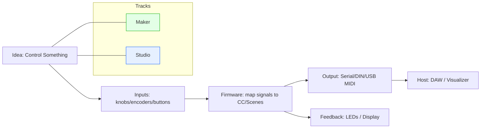

# MN42_Course_v2 — MOARkNOBS‑42 Course Family (Maker + Studio)

A two‑track, three‑level course series for building MIDI controllers and firmware architectures inspired by **MOARkNOBS‑42**.
Targets **ATmega/Arduino Uno** (general AVR baseline) so classrooms can start with robust, inexpensive hardware.

- **Maker Track**: teen/early‑college; playful, guided labs; build something every session.
- **Studio Track**: upper‑level/advanced; architecture, OOP, scheduling; deeper design prompts.

Each level is a **4‑week workshop** meeting **once/week for 2 hours**.

## Levels
1. **From Blink to MIDI** — pins, loops, analog → CC, serial/midi fundamentals  
2. **Object‑Oriented Control** — classes for inputs/encoders/LEDs, arrays of modules, PlatformIO habits  
3. **Firmware Architecture & Performance UX** — schedulers, EEPROM scenes, LED feedback/state, performance mapping

## How to choose a track
- Start with **Maker** when learners want hands‑on wins and lighter theory.
- Choose **Studio** when learners want reusable abstractions and system design.

## Hardware baseline
- Arduino **Uno** (ATmega328P) or compatible AVR board
- Breadboard + encoders/pots + LEDs + buttons
- (Optional) DIN‑5 MIDI OUT parts or Serial‑to‑MIDI bridge on host

## Printables
See `maker_track/PRINTABLES/` and `studio_track/PRINTABLES/` plus `shared/printables/`.

---
© 2025 MIT — see LICENSE.

## Course Overview (Mermaid)

