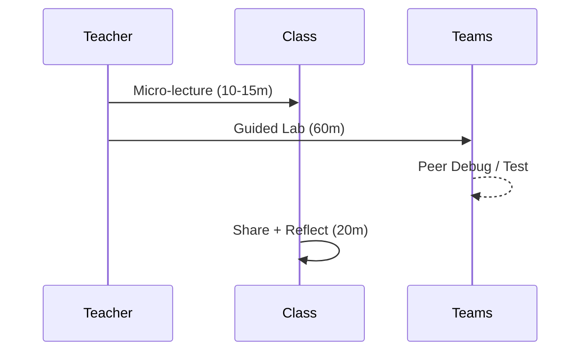

# Level 3: Firmware Architecture & Performance UX — 4×2h (Maker Track (teen/early‑college))

## Week 1 — Orientation + Core Concept
- Flash a working baseline (Blink→MIDI serial bytes on Uno)
- Pin map, inputs/outputs, analog → mapped control
- Goal set: what will your controller *do*?

## Week 2 — Focused Build
- Add encoders/pots and map to CCs
- Test with a MIDI monitor (serial‑bridge) or Processing visualizer
- Document decisions (CC map, ranges)

## Week 3 — Expansion & Customization
- Add a scene/state and a status LED pattern
- Refactor into functions (Maker) / classes (Studio)
- Mid‑demo and peer debug

## Week 4 — Showcase + Reflection
- Perform a short demo
- Summarize what worked and what you'd change
- Tag release in repo (v0.1)
        
**Focus:** Schedulers; EEPROM scenes; non‑blocking patterns; performance mapping; interface feedback.

### Weekly Flow

