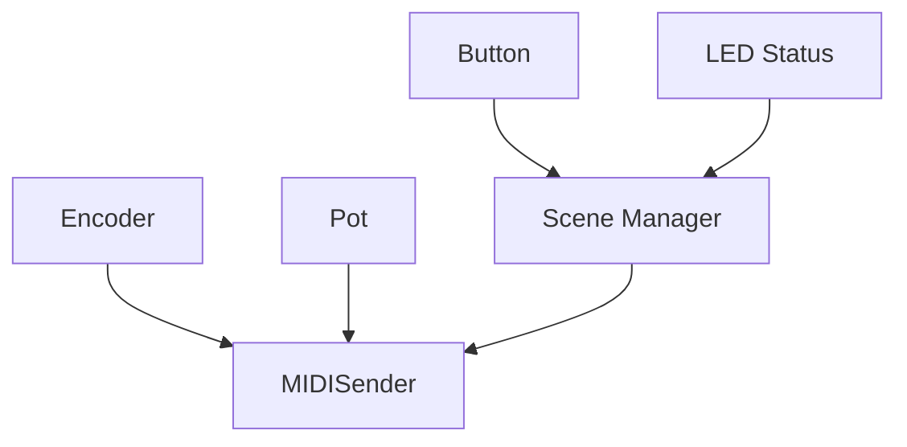

# Library / Repo Structure Guide

Typical PlatformIO/Arduino hybrid layout for MN42‑style projects:

```
/ (project root)
├─ src/               # .cpp implementations
├─ include/           # .h headers
├─ lib/               # external libraries (if vendored)
├─ test/              # unit tests (Unity / AUnit)
├─ platformio.ini     # envs, board = uno, teensy40, etc.
└─ examples/          # small, focused sketches
```

**Headers vs. Implementation**
- Public API in `include/`, private logic in `src/`.
- Keep modules small: `Encoder`, `LEDStrip`, `MIDISender`, `Scene`.

## Modules (Mermaid)

