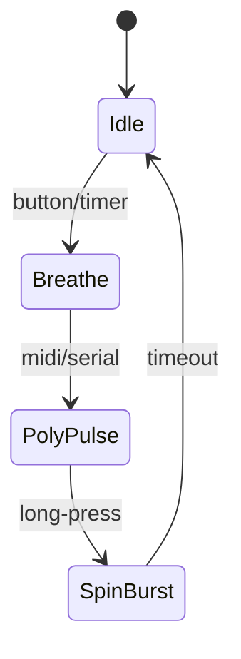

# Scene System Guide

A small state machine yields expressive behavior without blocking:

```cpp
enum Scene { Idle, Breathe, PolyPulse, SpinBurst };

void runScene(Scene sc, unsigned long now){
  switch(sc){
    case Idle:       setSpeeds(0,0); break;
    case Breathe:    { int p=2000; float ph=(now%p)/(float)p; int s=100+int((0.5-0.5*cos(2*PI*ph))*120); setSpeeds(s,s);} break;
    case PolyPulse:  { /* independent toggles left/right */ } break;
    case SpinBurst:  { /* spin then coast */ } break;
  }
}
```
- Transition triggers: button, timer, MIDI, serial command.
- Keep scenes non‑blocking; use `millis()` deltas.

## State Diagram

