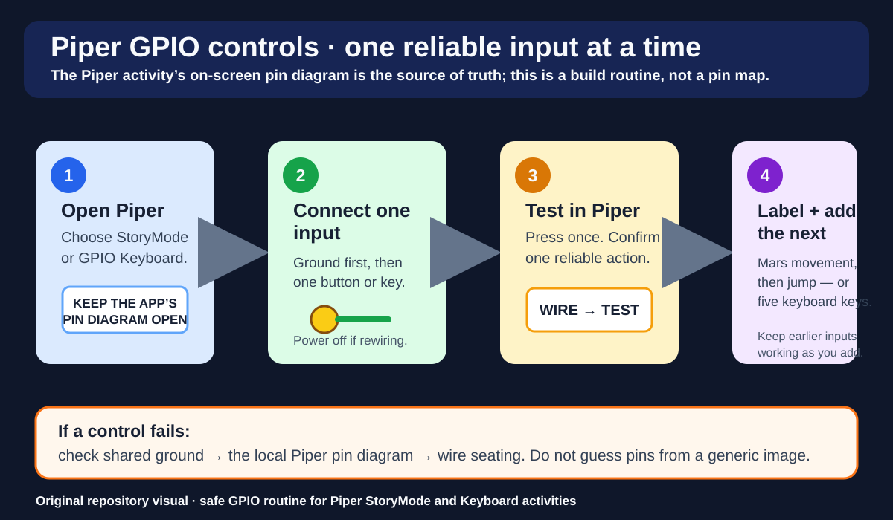

# Handout 00 — Build a Keyboard (Piper GPIO)

**Goal:** We are starting with *no physical keyboard.* You will build one using GPIO so you can play your Scratch game.

This is a **mouse-first** build:
1) use the mouse to open Piper,  
2) build the keyboard,  
3) test keys,  
4) then open Scratch and use your new keys to move.

---

## What you need
- A Piper computer (or Raspberry Pi running the Piper app)
- Piper GPIO keyboard activity available in the Piper app
- GPIO cable connected to the Pi
- Conductive parts for keys (your kit’s method: wires, alligator clips, conductive tape, foil, or Piper parts)
- Tape + marker for labeling

## Build routine visual

The current Piper activity's on-screen diagram controls every actual pin choice. Use the [Piper visual pack](../assets/piper/README.md) for the GPIO-header orientation photo and its CC attribution.

---

## Build steps (do these in order)

### 1) Open the Piper app (mouse only)
- Open **Piper**.
- Choose the **Keyboard / GPIO Keyboard** activity.
- Keep the on-screen diagram open — it shows which pins to use.

### 2) Connect the “ground” first
- Find **GND / Ground** on the diagram.
- Attach your ground clip/wire firmly.
- Ground is the “return path.” If ground is loose, **nothing works**.

### 3) Add 5 keys (minimum set)
Build **at least five** keys so Scratch games are playable:
- **Left**
- **Right**
- **Up**
- **Down**
- **Action** (often **Space**)

> Use the exact pins shown in Piper.  
> If Piper offers WASD instead of arrows, that’s okay — we can map Scratch controls to those keys.

### 4) Label your keys
Use tape + marker:
- “LEFT”, “RIGHT”, “UP”, “DOWN”, “ACTION”

### 5) Test in Piper
Most Piper keyboard activities have a test screen:
- Press each key.
- Confirm each key highlights / registers on screen.

If all keys register, you’re ready for Scratch.

---

## Scratch test (2-minute check)
Open Scratch and make a tiny test:

1) Pick any sprite.
2) Add these blocks (one for each key you built):

- **when [right arrow] key pressed** → **change x by (10)**
- **when [left arrow] key pressed** → **change x by (-10)**
- **when [up arrow] key pressed** → **change y by (10)**
- **when [down arrow] key pressed** → **change y by (-10)**
- **when [space] key pressed** → **say [hi!] for (1) seconds**

3) Press your DIY keys and confirm it works.

---

## Troubleshooting (fast)
**Nothing works**
- Ground clip/wire is loose or missing. Reattach **GND** first.

**One key doesn’t work**
- Check that key’s wire is on the correct pin.
- Wiggle/reattach the clip (gentle).
- Make sure the key is actually making contact (foil/tape/clip).

**It works in Piper but not in Scratch**
- Click inside the Scratch window once so it has focus.
- Confirm Scratch is listening for the same keys you built (arrows vs WASD).

---

## Finish ritual
- Take a quick photo of your keyboard build.
- Save your Scratch test project as:
  `FirstName_W00_KeyboardTest`
